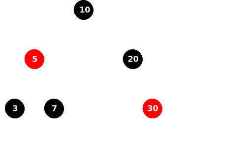

# **RedBlackTree**
##### *прежде...читать про BST и AVL...*
## **RedBlackTree это самобалансирующегося бинарное дерево поиска(как AVL),но использующее цвета узлов(красный-черный)**
## **Оно гарантирует что операции поиска,вставки,удаления будут в худшем случае O(log(n)),где n это количество узлов**
***Суть такая:***
каждая нода имеет цвет и это дерево поддерживает несколько правил,чтобы не стать слишком высоким(читать про то почему AVL крутится при случаях становления листом)  




## ***Правила RedBlackTree***

1. ***нода либо красная,либо черная***
```
Простая бинарная классификация цвета — основа для всех остальных правил.
Красный цвет — это «временный» индикатор нарушения баланса, который нужно исправить.
Черный — «стабильный» узел, на который можно опереться при подсчете высоты.
```
2. ***корень всего дерева всегда черная***
```
Если корень был бы красным, то путь от корня к листьям имел бы лишний красный узел.
Правило упрощает поддержание черной высоты всех путей.
При вставке нового узла его часто делают красным, но если он становится корнем, мы сразу перекрашиваем в черный
```
3. ***пустые ноды(листья) считаются черными***
```
Упрощает проверку черной высоты.
Листья NIL — это черные «фиктивные узлы», которые не нарушают правила.
Без этого правила было бы сложно считать, сколько черных узлов на пути к листу.
```
4. ***из красной ноды рождаются только черные ноды(у красного черные дети)***
```
Предотвращает появление последовательности красных узлов подряд, которые бы делали дерево не сбалансированным.
Красная нода — это «допустимое нарушение» баланса, но оно должно быть локальным.
Если красная нода имела бы красного ребенка, черная высота путей из этого узла стала бы разной — правило 5 нарушилось бы
```
5. ***Любой путь от узла до его потомков-листьев содержит одинаковое количество чёрных узлов. Это число называется чёрной высотой***
```
Это ключевое правило, которое гарантирует, что дерево почти сбалансировано.
«Почти сбалансировано» значит, что длина пути от корня до листа не больше 2× минимальной.
Благодаря этому поиск, вставка и удаление остаются O(log n)
```
***Легче***  
***красный узел*** про то что нужно балансировать дерево так,чтобы стало черным
как прыщ который нужно выдавить,если нет прыща дерево полностью черное,а когда есть короче(хотя не лучшая аналогия это как шахматная плитка которая не в своем месте или кубик рубика нужно мешать грани так чтобы встали на свои места)

*можно подчеркнуть как пример использования RBT в std::map*

```cpp

template <typename T>
class BinaryTree {
public:
    virtual void insert(T key) = 0;
    virtual void remove(T key) = 0;
    virtual Node<T>* find(T key);
    void inorder(Node<T>* root);
};


namespace RBT{
    enum Color{BLACK,RED};

    template<typename T>
    class RedBlackTree : public AbstractBinaryTree<T>{

        protected:
            class Node
            {
                public:
                T key;
                Color color;
                std::unique_ptr<Node> left;
                std::unique_ptr<Node> right;
                Node* parent;
                Node(const T& _key) : key(_key),color(Red),right(nullptr),left(nullptr),parent(nullptr){}
            };
        std::unique_ptr<Node> root;
        
        void fixInsert(Node* node);
        void fixRemove(Node* node);
        Node* rotateLeft(Node* x);
        Node* rotateRight(Node* y);

        public:
            RedBlackTree() : root(nullptr) {}
            void insert(const T& key) override {

            
            }
            void remove(const T& key) override {
            
            }
            std::unique_ptr<Node> search(const T& value) const;

    }


}


```