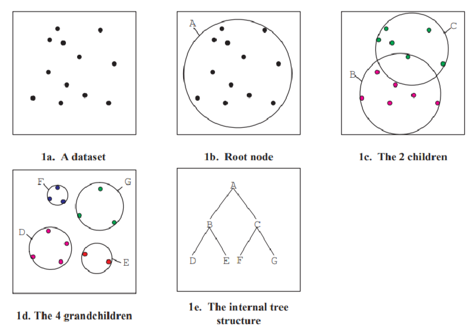

# **BallTree**

```
Шаровое дерево (Ball Tree) — это структура данных для эффективного поиска ближайших соседей в многомерном пространстве.

Это множество всех его подможеств главное множество в себе имеет все другие подможества.

Ball Tree рекурсивно разбивает множество точек на шары (гиперсферы).

Каждый узел дерева хранит:

центр шара;
радиус шара;
все точки, принадлежащие этому шару (или ссылки на них);
два дочерних поддерева для внутренних узлов.

```  

```
                    [все точки]
                  радиус = 100
                   /       \
                  /         \
          [шар A]           [шар B]
        радиус=50         радиус=45
          /  \              /   \
         ... ...          ...  ...
```  

## **Срез шара**  


| Задача                                            | Лучший кандидат   |
| ------------------------------------------------- | ----------------- |
| Космический симулятор                             | Октодерево        |
| Поиск ближайшей звезды среди статических объектов | k-d дерево        |
| Поиск похожих планет по характеристикам           | Ball Tree         |
| Пространственная база данных города               | R*-дерево         |
| Миллионы динамических юнитов в RTS                | Spatial Hash Grid |
| Трассировка лучей и коллизии                      | BVH               |  
  
  

каждый новый шар делит свое пространство на подшары и каждый шар имеет центр относительно которого группируем точки в кластеры по растоянию от этого центра  
то есть мы берем центр  шара по центроиду $1/N*\sum_i(x_i)$,
а сам радиус шара решается через max($|node.pivot - d(x,y)=\sqrt{\sum_{i=1}^{m}(x_i-y_i)^2}|$)  

то есть обобщенно ищем центр n мерного пространства содержящий все точки ее назовем root,
считаем растояния всех точек от центра root и берем максимальное это является радиусом нашего шара,круга,или чего то по сложнее если выходим за пределы 3ой метрики,
потом мы берем все точки и делим сам шар на два или больше подшаров для удобства разделим на два шара
берем все точки и сравниваем с центроидом то что меньше в левый кластер что больше в левый по ростоянию ростояние по пифагору итп

а потом делим еще на подшары если есть еще

берем случайную точку и еще самую дальную точку от нее,а потом самую далекую от этой точки 
эти две точки будут теми точками относительно которых будем группировать точки по кластерам,когда группировали 
через эти точки считаем новый центроиду через формулу 

1. $1/N*\sum_j(x_j)$

2. $1/N*\sum_k(x_k)$

можно делить на еще подгруппы,но не стану
